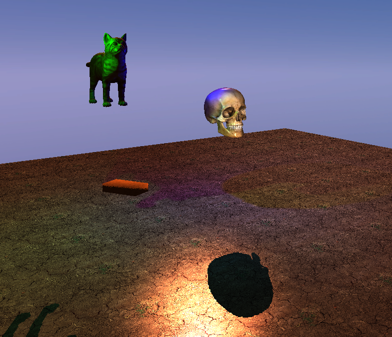

# renderer
C++ OpenGL renderer

As it stands now, this is undergoing active development as a Visual Studio
project. I may attempt to support linux builds in the future.

This currently targets 32-bit builds for portability, but I will likely
shift to just supporting 64-bit builds. These should be largely invisible
to anyone using this since I do not host my built dependencies in this project
(aside from `stb_image.h`, which I use for image I/O).

## Building

This project can be built with `cmake`. This is intended to support building on multiple
platforms.

The `CMakeLists.txt` is setup to find project dependencies on the local system
and install them if they are not available. For Linux systems, the
`setup/linux_deps.sh` can be used to install dependencies at the system level
using the linux distribution's package managers. For Windows systems,
there is a simple powershell script `setup\windows_deps.ps1` to install `cmake`.
The intent is to simply use `cmake` to pull and build dependencies for Windows systems.

### Dependencies

Besides OpenGL, this project depends on a few libraries (subject to change):

* [GLEW](http://glew.sourceforge.net/)
  * Might shift to SDL for the audio and improved controller input support.
* [GLFW](https://www.glfw.org/download.html)
* [GLM](https://glm.g-truc.net/0.9.9/index.html)
* [ASSIMP](https://www.assimp.org/index.php/downloads)
* [YAML-CPP](https://github.com/jbeder/yaml-cpp)
